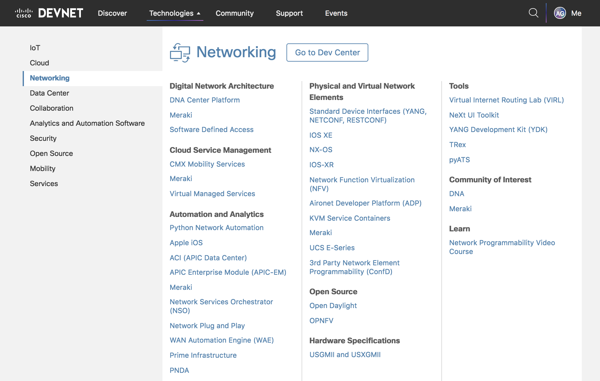

# Coding 101 - REST API Basics

This Learning Lab explains the basics of using a REST API. It also shows how to use Postman to explore a REST API.

## Objectives

* Understand REST APIs
* Learn how to use the Postman application to make API calls

## Prerequisites

  - [Postman](https://www.getpostman.com) installed.
  If you are on a DevNet Zone station, Postman is already installed.

  - Access to DNA Center. To run the code samples, you need access to DNA Center. You can use the DNA Center DevNet Sandbox:
      * https://sandboxdnac.cisco.com
      * **username:** devnetuser
      * **password:** Cisco123!

## Step 1: Find the DNA Center API Reference documentation

A good starting point to understand any API is to look at the documentation for the API. Now, find documentation for the DNA Center API.

1. In a browser, navigate to the [DevNet](https://developer.cisco.com/) home page.
1. Use the menu at the top to navigate to the DNA Center Platform page.
   * Click the **Technologies** link to see the submenu.
   * Click **Networking**.
   * From the list of technologies, click **DNA Center Platform**.

1. On the DNA Center Platform page, click the `Docs` link.
1. Click `API Reference`.
1. Select the latest API version.
1. Keep the DNA Center API Reference documentation open in a separate tab. This page provides a useful reference while you work on this lab.

### Next step

Proceed to Step 2: So what is a REST web service?
