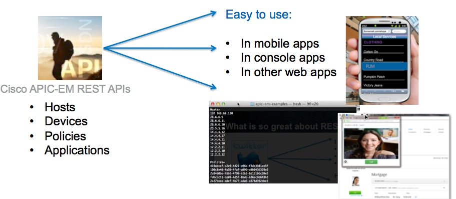
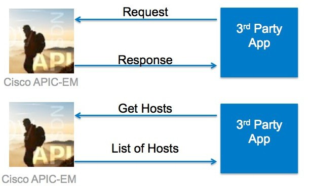

## Step 2: So what is a REST web service?

### What is a web service?

A web service is a way for two systems to communicate through a defined interface.
There are two major types of web services – **REST** and **SOAP**.

### What is a REST web service?

REST is an architecture style for designing networked applications.
A REST web service is as easy to call as making an HTTP request.
RESTful interfaces usually offer the CRUD (Create, Read, Update, Delete) operations.
To know more about REST in general, this is a great [REST definition](https://en.m.wikipedia.org/wiki/Representational_state_transfer).

### What are the benefits of REST?

***REST is easy to use on any platform.***

### DNA Center API is a REST API

For this lab, you are going to use the [DNA Center APIs](https://developer.cisco.com/site/dna-center-rest-api/).

DNA Center APIs enable deploying and running application policies across your networking infrastructure.

Using the DNA Center APIs, you can retrieve information about devices on your network including a list of hosts, network devices, or users. You are going to use these features as examples to learn how to make REST calls from Python.

Look at the [DNA Center documentation](https://developer.cisco.com/site/dna-center-rest-api/) to see the details of the functions.

### How does this work?

REST is centered around the HTTP request and response model. Consuming an API is as simple as making an HTTP request.

In this example, you request the list of hosts, and that information is returned to you in the response. The data returned in the response is usually formatted as JSON or XML.

* [JSON](https://www.json.org/) - JSON, or JavaScript Object Notation, is a lightweight text-based open standard designed for human-readable data interchange.

* [XML](https://www.w3schools.com/xml/xml_whatis.asp) - XML, or eXtensible Markup Language, a language designed to store and transport data.

**Next step:**

Proceed to Step 3: What do I need to know to make a request?
