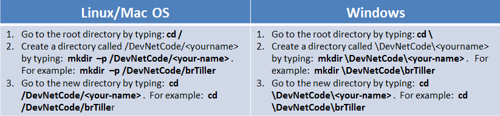

# Coding 102: Calling REST APIs from Python

In this Learning Lab, you learn the basics of how to call a REST API in Python.


## Objectives

* Understand how to call a REST API from Python.
* Explore ways to parse and use the JSON returned from the REST API.


## Prerequisites

**Background**

* Complete the [Coding Fundamentals](https://developer.cisco.com/learning/modules/programming-fundamentals) and [REST API Fundamentals](https://developer.cisco.com/learning/modules/rest-api-fundamentals) Learning Lab modules. if you are unfamiliar with Python and retrieving results from a RESTful service and the [Parsing XML using Python Lab](lab/coding-201-parsing-xml/step/1 "Parsing XML using Python Lab") for a similar approach to retrieving data using XML.

* You should also have a basic familiarity with JSON. Otherwise, consider visiting the [W3Schools JSON Tutorial](https://www.w3schools.com/js/js_json_intro.asp "W3Schools JSON Tutorial") to get a firm base to build upon.
* Complete the [Coding 101 Rest Basics Learning Lab](/lab/coding-101-rest-basics-ga/step/1) before you start this lab.

**Access to DNA Center**
* To run these code samples, you need Access to DNA Center.
* **If you are not using your DNA Center**, use the [DevNet Sandbox](https://sandboxdnac.cisco.com/) DNA Center Lab: https://sandboxdnac.cisco.com.

**Python**
* To run the code samples, you need to have Python 3 installed on your computer.
* **If you are working on a DevNet Learning Lab computer at a DevNet event**, Python 3.x is already installed..

For more information, click the "How to Set Up Your Computer" link at the top of this lab.

**Python Requests Library**
* These code samples use the Python Requests Library to simplify making REST API calls.
* **If you are working on a DevNet Learning Lab computer at a DevNet event**, the Requests Library is already installed.

For more information, click the "How to Set Up Your Computer" link at the top of this lab.

**Python Flask Library**
* Step 6 uses use the Python Flask Library to interface with NeXt UI.
* **If you are working on a DevNet Learning Lab computer at a DevNet event**, the Flask Library is already installed.

For more information, click the "How to Set Up Your Computer" link at the top of this lab.

**Clone Git Repo**
* **If you are working on a DevNet Learning Lab computer at a DevNet event**,
    * Open the Git Command window by clicking the *Git CMD* icon on the Task Bar or click the Start button. Then, in the Run bar, enter: `git cmd`.
* **If you are working from your computer**, on your computer open a command terminal.
<br/><br/>
* Clone the coding skills sample code from GitHub. Enter the following command. This will copy Cisco DevNet's coding samples directory down to your computer so you may work with it locally.
```
git clone https://github.com/CiscoDevNet/coding-skills-sample-code
```
<br/><br/>
Inside the directory you created, , you should see a new directory, 'coding-skills-sample-code'.<br/><br/>
<br/><br/>

## Step 1: Find the DNA Center API Reference documentation

A good starting point to understand any API is to look at the documentation for the API. Now, find documentation for the DNA Center API.

1. In a browser, navigate to the [DevNet](https://developer.cisco.com/) home page.
1. Use the menu at the top to navigate to the DNA Center Platform page.
   * Click the **Technologies** link to see the submenu.
   * Click **Networking**.
   * From the list of technologies, click **DNA Center Platform**.


1. On the DNA Center Platform page, click the `Docs` link.
1. Click `API Reference`.
1. Select the latest API version.
1. Keep the DNA Center API Reference documentation open in a separate tab. This page provides a useful reference while you work on this lab.

**Next step:**

Proceed to Step 2: Make your first REST call from Python.
