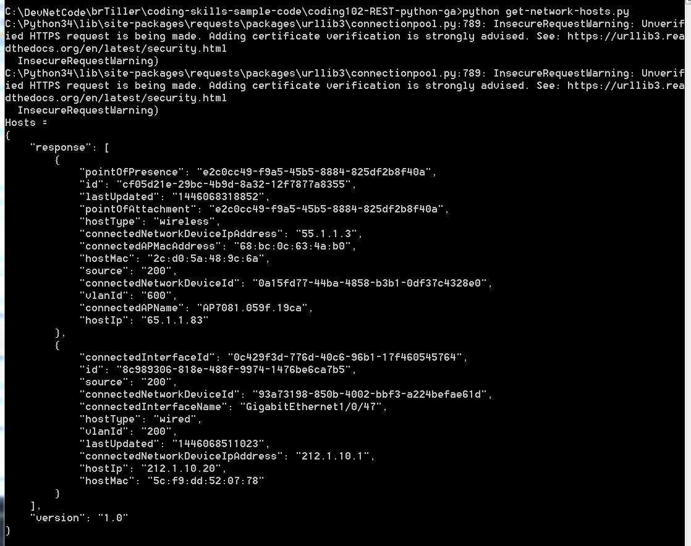

## Step 3: Get information about the network

You are going to build on the previous example and learn how to use the JSON in the response.

The following files are located on your computer in  `/DevNetCode/~your-name~/coding-skills-sample-code/coding102-REST-python-ga/`
* `create-ticket.py` - Example to create a token. Used in Step 2.
* `get-network-hosts.py` – First application to parse the token response and show the list of hosts by doing a pretty print of the JSON data
* `get-network-devices.py` – Retrieves network device list and parses JSON to display `networkDeviceId` values
* `build-topology.py` – Shows how to retrieve devices/interfaces and build a spreadsheet-like text topology
* `build-topology-web-server.py` – Shows how to retrieve devices/interfaces and build a graphical topology


#### get-network-hosts.py
This sample code uses the host `REST` function call to retrieve a list of the network hosts. A host is an end device (e.g., computer) connected to a network device (e.g., switch). Your goal is to find the hosts and display information about them.


```python
# Import requests library
import requests

# Import json library
import json

# Variable to hold access to the controller
controller='sandboxdnac.cisco.com'

# Create the token URL
url = "https://" + controller + "/api/v1/ticket"

# The username and password to access the DNA Center
payload = {"username":"devnetuser","password":"Cisco123!"}

# Content type must be included in the header
header = {"content-type": "application/json"}

# Perform a POST on the specified url to get the token
response= requests.post(url,data=json.dumps(payload), headers=header, verify=False)

# Convert response to JSON format
r_json=response.json()

# Parse the JSON to get the token
ticket = r_json["response"]["serviceTicket"]

# URL for Host REST API call to get list of existing hosts on the network.
url = "https://" + controller + "/api/v1/host"

# Include the content type and ticket in the header
header = {"content-type": "application/json", "X-Auth-Token":ticket}

# This statement performs a GET on the specified host url
response = requests.get(url, headers=header, verify=False)

# json.dumps serializes the JSON into a string and enables you to
# Print the response in a 'pretty' format with indentation etc.
print ("Hosts = ")
print (json.dumps(response.json(), indent=4, separators=(',', ': ')))
```

Now, look at what the code is doing. Focus on the key code changes.

* `controller='sandboxdnac.cisco.com'`
    * Assign the variable named `controller` the DNA Center IP or DNS. The DNS assigned here is for the DNA Center Sandbox.
* `url = "https://" + controller + "/api/v1/ticket"`
    * Build the URL for the token call by concatenating the strings.
* `r_json=response.json()`
    * Convert the returned data to JSON format so can get access to the string.
* `ticket = r_json["response"]["serviceTicket"]`
    * Access the response data to get the service Ticket information.
* `header = {"content-type": "application/json", "X-Auth-Token":ticket}`
    * Pass in token designated as "X-Auth-Token" for API authentication.
* `print (json.dumps(response.json(), indent=4, separators=(',', ': ')))`
    * Pretty print the output so is easy-to-read.

To run this code sample:
1. In a terminal, change directories to `coding102-REST-python-ga` by entering:
    `cd \DevNetCode\~your-name~\coding-skills-sample-code\coding102-REST-python-ga`
2. Assign the DNA Center IP address or DNS to the **controller** variable.
    * Open the file `get-network-hosts.py`. For example, in Windows, enter: `notepad get-network-hosts.py`
    * *If you are not using your DNA Center*, use the [DevNet Sandbox](https://developer.cisco.com/site/devnet/sandbox/) DNA Center Lab: [sandboxdnac.cisco.com](https://sandboxdnac.cisco.com)
        * controller='sandboxdnac.cisco.com'
3. Save the file. If encoding type is an option, select **UTF-8**.
4. At the command prompt, enter the `python` command followed by the filename.
    * On Windows, enter: `py -3 get-network-hosts.py` or `python get-network-hosts.py`
    * On macOS or Linux, enter: `python3 get-network-hosts.py`
5. The program should run or display an error message.

    You should see a result like the following one.



### Things to try
* Do you see the ID for each network host?  
* In the file `get-network-hosts.py` append `?limit=1&offset=1` to the host url so it reads as `url = "https://" + controller + "/api/v1/host?limit=1&offset=1"`. Then, run the code again. What change occurred and why?

Next, you learn how to get Network Devices and make your source code easier to read.

**Next step:**

Proceed to Step 3: What do I need to know to make a request?
