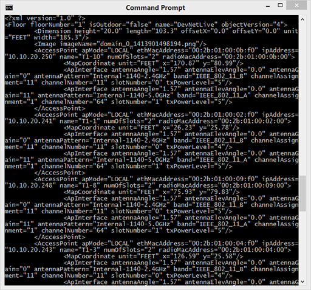

## Step 2. Understand the returned XML data

Before parsing the returned XML, take a moment to understand the structure and contents of the XML. It is difficult to see what an unformatted blob of text represents. So, the next step is to format the returned data so you can see its structure.

### Using Python's Minidom Library

The large XML result that the script returns is a string. Thankfully, Python comes with a library that provides a Minimal DOM implementation called *Minidom*. Mindom can "pretty print" XML in a more human-readable format.

1. To use this functionality, modify `get-tenant.py` and insert this import statement on the second line, which imports the Minidom library:
```
import xml.dom.minidom
```
2. Replace the `print(tenants.text)` line with the following:
```
dom = xml.dom.minidom.parseString(tenants.text)
xml = dom.toprettyxml()
print(xml)
```
This snippet:
- parses `response.text` as Document Object Model (DOM)
- calls a method off of Minidom that returns a string as formatted XML
- printing the formatted XML
3. Save the `get-tenant.py` file. To download or review the current code, you can get it from GitHub <a href="https://github.com/CiscoDevNet/coding-skills-sample-code/blob/master/coding201-parsing-xml/get-ap-xml-2.py" target="_blank">here</a>.

4. Run your `get-tenant.py` file using Python:
```
python get-tenant.py
```
> **Note**: Ensure that the Python version in use is greater than 3.4.  If you get errors, verify the version of Python and double-check the code.
 
The response is still a formidable amount of text, but you can see some of the structure of the XML document itself.



----------

A key point to notice is the hierarchical structure of the returned data. Notably, the XML element with the tag name `fvTenant` has sub-objects which can have objects (depending on how we filter our query for data against the APIC). For this exercise, we are interested in the returned tenants (`fvTenant`), their names, and their current health scores.  Because the `healthInst` object is a sub-object of the `fvTenant`, we have to move between different levels of the returned XML to get the information we want, in thie case the `name` inside of `fvTenant` and `cur` inside of `healthInst`.

Structurally, the XML elements have the following order:

&lt;fvTenant&gt;<br/>
&nbsp;&nbsp;&nbsp;&nbsp;&lt;healthInst/&gt;<br/>
&lt;/fvTenant&gt;<br/>

It may not look interesting, but inside of each of the tags, we can see that multiple values are stored for different properties of that element.

In the description shown, the elements tagged as `fvTenant` have sub-elements of `dn` and `modTS` and `name` (there are more, but they will likely be blank), which detail the "Distinguished Name" of the object, its modification time, and its "Relative Name (name)"  A full `fvTenant` element from the data can look like this (you'll see the `healthInst` tag nested inside of the `fvTenant`):
```
<fvTenant annotation="" childAction="" descr="" dn="uni/tn-infra" extMngdBy="" lcOwn="local" modTs="2020-04-19T19:35:27.958+00:00" monPolDn="uni/tn-common/monepg-default" name="infra" nameAlias="" ownerKey="" ownerTag="" status="" uid="0">
    <healthInst childAction="" chng="0" cur="100" maxSev="cleared" modTs="never" prev="100" rn="health" status="" twScore="100" updTs="2020-04-22T19:27:33.002+00:00"/>
</fvTenant>
```
Where the tag is "fvTenant" and the attributes follow after the tag.  You can also see the health tag and its subsequent attributes.

For a complete reference about map information from CMX, review the online documentation at [https://developer.cisco.com/site/cmx-mobility-services/documents/api-reference-manual/#maps-api](https://developer.cisco.com/site/cmx-mobility-services/documents/api-reference-manual/#maps-api "Online Documentation for CMX Maps API")

Now, you have a better understanding of what the structure looks like. Next, you'll parse the data.

### Next step

Proceed to Step 3: Get XML elements in Python.
