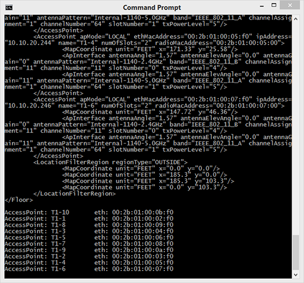

## Step 3: Get XML elements in Python

### Iterate through elements in XML

Because you know the structure of the returned XML, the first approach could be to get the first element and sift through that elements children looking for the ones that match what you are looking for. This could be the tag name of the element, a particular value of an attribute, whether or not a child has sub-elements, or even the element's position in the hierarchy of the XML document. For example, you may want to get only the 3rd-level children from the root of the document. Another example might be that you want to get all of the child nodes with a particular attribute whose value is `100`.

To understand how this might work, modify your script to include some code that loops through the children looking for the information you want to collect, keeping in mind that we'll need to loop through two tiers of tags and store the variables accordingly. Here, find the `fvTenant` elements, output the name of the tenant (`name`), then find the `healthInst` element within each `fvTenant` and print the current health score (`cur`).

1. In `get-tenats.py`, insert the following after the `print(xml)` line. Keep the spaces because Python is sensitive to indentation.
```python
tenant_objects = dom.firstChild
if tenant_objects.hasChildNodes:
    tenant_element = tenant_objects.firstChild
    while tenant_element is not None:
        if tenant_element.tagName == 'fvTenant':
            health_element = tenant_element.firstChild
            output = "Tenant: "  + tenant_element.getAttribute('name') + '\t Health Score: ' + health_element.getAttribute('cur')
            print(output.expandtabs(40))
            tenant_element = tenant_element.nextSibling
```
This snippet:
-  Gets the first element from the Document Object Model (DOM).
-  Determines if the first element has children.
-  If the first element has children, it begins iterating through them.
- As it iterates through the first elements children, it stores the second element's children as variables for access of information
-  For each child, if its tag name is `fvTenant`, print out its `name` and current health score (stored in the `cur` attribute of the `healthInst` tag for a given `fvTenant`).
-  The `expandtabs(40)` at the end of `print` statement allows for an easy view of returned data, as the name of each tenant could be of diffent length.  If the columns are not aligned, increase the value to something larger (50 or so).


1. Save the `get-tenants.py` file. To download or review the current code, you can get it from GitHub <a href="https://github.com/CiscoDevNet/coding-skills-sample-code/blob/master/coding201-parsing-xml/get-ap-xml-3.py" target="_blank">here</a>.

2. Enter the following command to run your file.
```
python get-tenants.py
```
> **Note**: Ensure that the Python version in use is greater than 3.4.  If you get errors, verify the version of Python and double-check the code.

When you run the Python script, you should get an output at the end of the data values extracted from the XML returned for each tenant.



----------

Using Python and Minidom, you have extracted specific information from ACI using the `fvTenant` and nested `healthInst` elements and retrived values defined by the element's attributes.  However, what if you want to quickly get the `fvTenant` name and you don't care about anything else in the document?  Next, look at how you could parse that out quickly.

### Next step

Proceed to Step 4: Get XML elements in Python.
