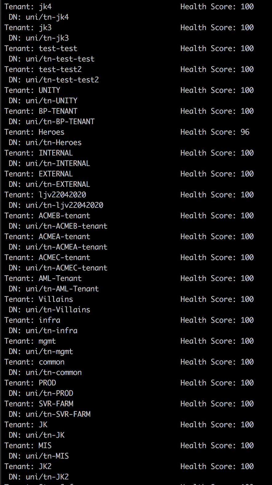

## Step 4: Get XML elements in Python

### Retrieve Elements by Tag Name

Rather than manually evaluate each child in a series of nodes, Minidom offers functionality to extract a collection of elements by their tag name. You can use the `getElementsByTagName()` method to return an array of elements.

1. In `get-tenants-xml.py`, replace the code you inserted in Step 3 (everything after the `print(xml)` line) with the following code. (Be careful to maintain the indentation.)

```python
tenant_list = dom.getElementsByTagName('fvTenant')
for tenants in tenant_list:
    tenant_name = tenants.getAttribute('name')
    tenant_dn = tenants.getAttribute('dn')
    health_score = tenants.firstChild.getAttribute('cur')
    output = "Tenant: " + tenant_name + "\t Health Score: " + health_score + "\n DN: " + tenant_dn
    print(output.expandtabs(40))
```

This snippet:
-  Gets elements whose tag is `fvTenant`.
-  Iterates through those elements.
-  Stores the healthscore by looking at the `firstChild` of the tenant, which is `healthInst`, then gets the `cur` health score attribute
-  For each child, prints out its `name`, `cur` health score, and the tenant `dn` with appropriate formatting

1. Save the `get-tenants-xml.py` file. To download or review the current code, you can get it from GitHub <a href="https://github.com/CiscoDevNet/coding-skills-sample-code/blob/master/coding201-parsing-xml/get-tenants-xml-4.py" target="_blank">here</a>.

2. Enter the following command to run your file.
```
python get-tenants-xml.py
```
> **Note**: Ensure that the Python version in use is greater than 3.4.  If you get errors, verify the version of Python and double-check the code.

When you run the Python script, it should return output that is similar to what you saw before, with the addition of the tenant distinguished name below the tenant name.



----------

Using Python and Minidom, you have extracted and displayed specific information from ACI.

Next, in the last step, see which resources you can use to learn more about parsing XML with Python.

**Next step:**:

Proceed to Step 5: Find additional resources.
