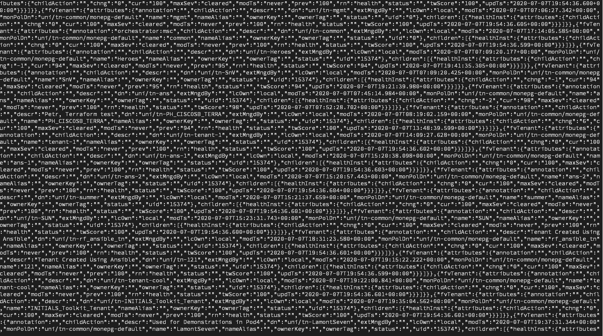

# Parsing JSON using Python

In this Learning Lab, you learn the basics of parsing JSON content using Python. The example runs a query on the [ACI Always-On Sandbox](https://devnetsandbox.cisco.com/RM/Diagram/Index/5a229a7c-95d5-4cfd-a651-5ee9bc1b30e2?diagramType=Topology "ACI Always-On Sandbox") to request data for available configuration on the fabric. You will then parse this returned data and print it to the screen for human readability.  

To learn more about ACI and its API, you can review the DevNet [Learning Lab track for ACI programmability](https://developer.cisco.com/learning/tracks/aci-programmability), which teaches a variety of different ways to interact with ACI programmatically.  ACI is used as a basis for these labs as the managed object model within ACI allows us to query the same object or class within the fabric and return both XML and JSON data structures, simply based on changing the file-type within the REST URL.

## Objectives

When you have completed this Learning Lab, you will be able to:

* Understand the basics of reading and parsing HTTP content using Python.
* Learn how to use Python to extract only the JSON data you want using the JSON library.

## Prerequisites

* Complete the [Coding Fundamentals](https://developer.cisco.com/learning/modules/programming-fundamentals) and [REST API Fundamentals](https://developer.cisco.com/learning/modules/rest-api-fundamentals) Learning Lab modules if you are unfamiliar with Python and retrieving results from a RESTful service and the [Parsing XML using Python Lab](lab/coding-201-parsing-xml/step/1 "Parsing XML using Python Lab") for a similar approach to retrieving data using XML.

* You should also have a basic familiarity with JSON. Otherwise, consider visiting the [W3Schools JSON Tutorial](https://www.w3schools.com/js/js_json_intro.asp "W3Schools JSON Tutorial") to get a firm base to build upon.

* For this lab, use Python 3.4+. To verify your version, enter the following command in a terminal:

```
    python --version
```

If you are on a DevNet Zone station, the correct version of Python should already be installed.

# Step 1: Make an HTTP REST call with Python

> **Note**: This lab leverages the DevNet Always-On ACI Sandbox, however you can substitute this with a local APIC if you have one available.  The sets of sample code contained within this lab will not perform any write or configuration actions against the fabric; they will only request currently configured data.

To get started, this walk-through shows creating a simple Python script that sends an HTTP request to the ACI sandbox.

1. Open a text editor and create a file named `get-tenant-json.py`.
3. Add the following lines to `get-tenant-json.py`:

  ```python
  import requests
  # We need to import the JSON library just to handle our request to the APIC for login
  import json
  # We need to log in to the APIC and gather a token, before we can access any data
# Let's construct a request with a body

# We'll need to disable certificate warnings
requests.packages.urllib3.disable_warnings()

# We need to have a body of data consisting of a username and password to gather a cookie from APIC
encoded_body = json.dumps({
	        "aaaUser": {
		        "attributes": {
			        "name": "admin",
			        "pwd": "ciscopsdt"
                 }
            }
})

# Now lets make the request and store the data
resp = requests.post("https://sandboxapicdc.cisco.com/api/aaaLogin.json", data=encoded_body, verify=False)

# This stores the received APIC-cookie from the login as a value to be used in subsequent REST calls
header = {"Cookie": "APIC-cookie=" +  resp.cookies["APIC-cookie"]}

# Now we make a call towards the tenant class on the ACI fabric with the proper header value set.
# We leverage the .xml ending to receive the data back as XML.  We're adding health and faults to the printout to ensure that we get levels of data back from the APIC
tenants = requests.get("https://sandboxapicdc.cisco.com/api/node/class/fvTenant.json?rsp-subtree-include=health,faults", headers=header, verify=False)

# Requests stores the text of the response in the .text attribute.  Lets print it to see raw JSON
print(tenants.text)
```
There is a lot of manipulation going on with the top part of this script, but most of it deals with the methods needed to authenticate towards the ACI fabric, needing a username and password to authenticate, receive the response from the fabric and gather a token, then send this token in a subsequent call to the fabric to pull the ACI tenant information out in JSON format.  However, this snippet:

  - imported the `request` library to easily interact with the ACI fabric's REST APIs
  - constructed a call to authenticate against the APIC and store the authentication token as a cookie to be used later
  - created a request to ask for all configured tenants in the fabric using the stored authentication cookie
  - accessed the response from the query and printed the raw JSON output to the console/terminal  <br>

4. Save the `get-tenant-json.py` file. To download or review the current code, you can get it from GitHub [here](https://github.com/CiscoDevNet/coding-skills-sample-code/blob/master/coding202-parsing-json/get-tenant-json-1.py).

5. Open a command prompt.<br>
  <br>
  For Windows, enter:

  ```
  cd %USERPROFILE%\Desktop
  ```

  For OS X, enter:

  ```
  cd ~/Desktop
  ```

6. In the command prompt window, enter:

  ```
  python get-tenant-json.py
  ```

7. The command line/terminal displays the JSON data retrieved by the script.



--------------------------------------------------------------------------------

This presentation of the JSON data isn't very useful. Next, clean up the presentation to get a better view of the structure and content of the data.

**Next step:** Proceed to Step 2: Use the JSON Python library.
