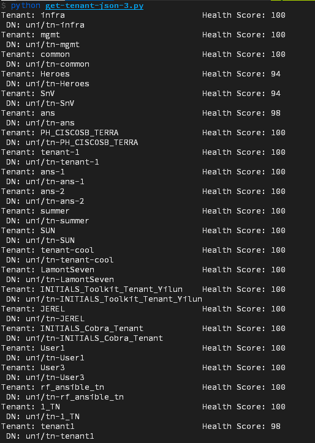

## Step 3: Iterate through a JSON dictionary in Python

### Loop through a Python dictionary

In the previous step, you decoded the JSON content into a `json_response` variable.  This conversion allows a developer to easily access the information contained within using loops to iterate through the data.  Using this method, we will loop through the tenants, print their name, DN, and their health score.

To loop through the tenants within a dictionary, first get the tenants using the `json` library. Then, use a Python `for` loop to go through each element of the list.  A second loop won't be required, as the list contained within the `children` element returned only contains a single value, `healthInst`.

Keep in mind that you may need to reference the pretty-print JSON that we created in the previous section, focusing on a single tenant within the output, in order to iterate through the object correctly.  You can also run the script from the previous section in "interactive" mode using `python -i`, which will allow you to interact with the stored variables to determine what the nested types are and how to access different elements to get to the desired key-value pairs in the JSON.

> **Note**: this looks like a lot of manipulation and parsing, but it will provide a very good testbed to understand how to iterate through JSON

1. Preserving the indentation, comment out the previous print statement (wherein we printed the "pretty" JSON) and add the following lines:

  ```python
json_tenants = json_response['imdata']
for tenant in json_tenants:
    tenant_name = tenant['fvTenant']['attributes']['name']
    tenant_dn = tenant['fvTenant']['attributes']['dn']
    tenant_health = tenant['fvTenant']['children'][0]['healthInst']['attributes']['cur']
    output = "Tenant: " + tenant_name + "\t Health Score: " + tenant_health + "\n DN: " + tenant_dn
    print(output.expandtabs(40))
  ```

  This snippet:

  - Starts the initial entry point inside of the `imdata` dictionary
  - Creates a `for` loop to iterate through the list of `fvTenant` objects sequentially
  - Gathers the `name` and `dn` values within the `attributes` dictionary contained within the `fvTenant` dictionary
  - Gathers the current health score by pulling the value from the `children` dictionary.  This is pulled from the list of child objects (there's only a single item, which is why this can be safely set to `0`), and then moving through the `healthInst` dictionary, followed by the `attributes` dictionary and pulling the value from `cur`
  - Prints the resulting data with nice formatting, using the `expandtabs` method.  If the resulting printed data is not aligned, increase this value to 50 or so (results will vary due to length of configured tenant names on the fabric at any one time)

2. Save the `get-tenant-json.py` file.  To download or review the current code, you can get it from GitHub [here](https://github.com/CiscoDevNet/coding-skills-sample-code/blob/master/coding202-parsing-json/get-tenant-json-3.py)

3. Enter the following command to run your file.

  ```
  python get-tenant-json.py
  ```

4. When you run the Python script, at the end of the output, you should get the JSON data values returned for each tenant in a format that looks similar to this:



--------------------------------------------------------------------------------

This is a very direct way to use Python to get data from a REST service using JSON and parse out only the information you care about. Depending on the capabilities of the REST API, you can also sometimes pass in query parameters or other information to reduce the scope of returned data or search for a single or group of specific items.

For a summary of resources, continue on to the last step.

**Next step:**

Proceed to Step 4: Find additional resources.
