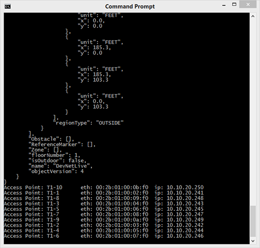

## Step 3: Iterate through a JSON array in Python

### Loop through a Python array

In the previous step, you decoded the JSON content into a `json_object` variable. To loop through the Access Points within as an array, first get the Access Points using the `json` library. Then, use a Python `for` loop to go through each element of the array.

1. Preserving the indentation, insert the following lines just before the `response.close()` line, near the end of `get-ap-json.py`.

  ```
  access_points = json_object['accessPoints']
  for ap in access_points:
    print('Access Point: ' + ap['name'] + '\t mac: ' + ap['radioMacAddress'])
  ```

  This snippet:

  - References the `AccessPoints` inside the JSON Object as a Dictionary using square brackets.
  - Loops through the `accessPoints` array, printing out the information from each `ap`.<br>
    <br>

2. Save the `get-ap-json.py` file.

3. Enter the following command to run your file.

  ```
  python get-ap-json.py
  ```

4. When you run the Python script, at the end of the output, you should get the JSON data values returned for each Access Point in a format that looks similar to this:



--------------------------------------------------------------------------------

This is a very direct way to use Python to get data from a REST service using JSON and parse out only the information you care about. Depending on the capabilities of the REST API, you can also sometimes pass in query parameters or other information to reduce the scope of returned data or search for a single or group of specific items.

For more on what is available from CMX, look to the [Mobility Services Engine (MSE) API Documentation](https://developer.cisco.com/site/cmx-mobility-services/documents/api-reference-manual/). For a summary of resources, continue on to the last step.

### Next step

Proceed to Step 4: Find additional resources.
