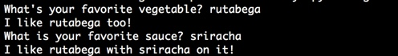

## Step 2: Try it out!
Here is some example code that asks a user to enter his/her favorite vegetable, and then creates a response using the vegetable that was entered.

```python
favorite_veg = input("What's your favorite vegetable? ")
print("I like " + favorite_veg + " too!")

favorite_sauce = input("What is your favorite sauce? ")
print("I like " + favorite_veg + " with " + favorite_sauce + " on it!")

```
Now, look at what is going on in the code.

* The **input("What's your favorite vegetable? ")** statement asks the user the question and waits for the response.
* The response the user types is stored in the variable named `favorite_veg`.
* You can use `favorite_veg` in your program the way you normally use variables.

### Give it a try!

To run this code sample:
1. Open a text editor.
    * For example, *on a DevNet Learning Lab computer*, open Notepad++. (**Start > Notepad++**)
3. Create a folder for this lab.
    * For example, *on a DevNet Learning Lab computer*, create a folder in "C:\Coding-101\yourname".
6. Copy/paste the code shown into your new file.
7. Save the file with the `.py` extension to your new directory. For example, `get-user-input.py`.
8. Open a command prompt.
    * For example, *on a DevNet Learning Lab computer*, click **Start > Command Prompt**
9. At the command line, go to the directory where you saved the `get-user-input.py` file.
    * For example, *On a DevNet Learning Lab computer*, enter: `cd C:\Coding-101\yourname`
10. At the command prompt, enter the `python` command followed by the filename.
    * On Windows, enter: `py -3 get-user-input.py`
    * On macOS or Linux, enter: `python3 get-user-input.py`
11. The program should run or display an error message.

You should see a result like this:



### Things to try
* Try asking for some new inputs.
* Try constructing some new responses based on the inputs.
* Try using an [if](https://docs.python.org/3.4/reference/compound_stmts.html# if) statement to make your response vary based on the user's input.
