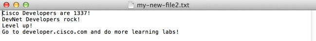

## Step 4: Append to a file
Look at the following code.

What do you think the result will be?

```python
print ("Writing to file..")

# You can open the file using 'with'.
# 'with' provides better exception handling and closes the file
with open("my-new-file2.txt", "w") as file:
    file.write("Cisco Developers are 1337!\n")
    file.write("DevNet Developers rock!")

print ("Do some stuff outside of the block")

# open the file again and append some additional text
with open("my-new-file2.txt", "w") as file:
    file.write("Level up!\n")
    file.write("Go to developer.cisco.com and do more learning labs!")

```
Copy this code into your `write-file.py` file and run it.

What happened?


* The first two lines that you wrote are **OVERWRITTEN** by the second two lines. Oops!
    * When you open a file using the `w` Write mode, the file is written over if it exists.
* But, what if you want to add to file?
    * To append to a file, use `a` when opening the file.

Here is an example:

```python
print ("Writing to file..")

# You can open the file using 'with'.
# 'with' provides better exception handling and closes the file
with open("my-new-file2.txt", "w") as file:
    file.write("Cisco Developers are 1337!\n")
    file.write("DevNet Developers rock!")

print ("Do some stuff outside of the block")

# open the file again and append some additional text
with open("my-new-file2.txt", "a") as file:
    file.write("Level up!\n")
    file.write("Go to developer.cisco.com and do more learning labs!")
```

### Give it a try!

To run this code sample:
1. Open a text editor.
    * For example, *on a DevNet Learning Lab computer*, open Notepad++. (e.g., **Start > Notepad++**)
3. Open your `write-file.py` file you created in the previous step.
6. Copy/paste the code shown into your new file.
7. Save the file with the extension `.py` in your new directory. For example, `write-file.py`.
8. Open a command prompt.
    * For example, *on a DevNet Learning Lab computer*, click **Start > Command Prompt**.
9. At the command line, go to the directory where you saved the `write-file.py` file.
    * For example, *on a DevNet Learning Lab computer*, enter: `cd C:\Coding-205\yourname`
10. At the command prompt, enter the `python` command followed by the filename.
    * On Windows, enter: `py -3 write-file.py` or enter: `python write-file.py`
    * On Mac OS or Linux, enter: `python3 write-file.py`
11. The program should run or display an error message.

Your text file should contain the following when you open it after running your program.



## Next step

Proceed to Step 5: Save data from JSON to a file.
