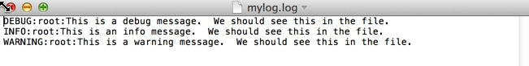

## Step 3: Log to a file
Normally, you want to save your logs to a file that can be opened and reviewed at any time.

Here is an example that logs to a file instead of to the console.

```python
# Import logging module
import logging

# Specify that you want to log to a file named mylog.log and that you want to track messages at the DEBUG level
logging.basicConfig(filename='mylog.log',level=logging.DEBUG)

logging.debug('This is a debug message. You should see this in the file.')
logging.info('This is a debug message. You should see this in the file.')
logging.warning('This is a debug message. You should see this in the file.')
```

Now, look at what is going on in the code.

* First, import the logging module - `import logging`.
* The `logging.basicConfig(filename='mylog.log',level=logging.DEBUG)` statement specifies the file to which you want to log messages. It also sets the logging level to `DEBUG`.

### Give it a try!

To run this code sample:
1. Open a text editor.
    * For example, *on a DevNet Learning Lab computer*, open Notepad++ (**Start > Notepad++**).
3. Create a folder for this lab.
    * For example, *on a DevNet Learning Lab computer*, create a folder in "C:\Coding-206\yourname".
6. Copy/paste the code shown into your new file.
7. Save the file with the extension `.py` in your new directory. For example, `logging-step3.py`.
8. Open a command prompt.
    * For example, *on a DevNet Learning Lab computer*, click **Start > Command Prompt**.
9. At the command line, go to the directory where you saved the `logging-step3.py` file.
    * For example, *on a DevNet Learning Lab computer*, enter: `cd C:\Coding-206\yourname`
10. At the command prompt, enter the `python` command followed by the filename.
    * On Windows, enter: `py -3 logging-step3.py`
    * On macOS or Linux, enter: `python3 logging-step3.py`
11. The program should run or display an error message.

Now open the file `mylog.log`. You should see a result like the following one.



**Next step:**

Proceed to Step 4: Format the log messages.


### Things to try
* Experiment with the different levels to log and display messages.
* Try running the program multiple times. Is the log file overwritten or appended to?
