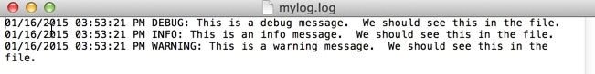

## Step 4: Format the log messages

When debugging an application, it is handy to have date and time stamps on the log messages.

Python provides a way to include the date and time in log messages.

The following example adds the date and time and some custom formatting the messages.

```python
# Import the logging module
import logging

# Specify to log to a file, specify the format for the message and the date format and the logging level
logging.basicConfig(filename='mylog.log',format='%(asctime)s %(levelname)s: %(message)s',datefmt='%m/%d/%Y %I:%M:%S %p', level=logging.DEBUG)

# Log some messages
logging.debug('This is a debug message. You should see this in the file.')
logging.info('This is an info message. You should see this in the file.')
logging.warning('This is a warning message. You should see this in the file.')

```
Now, look at what is going on in the code.

* First, import the logging module - `import logging`
* Add some new things to the `logging.basicConfig` statement.
    * `format='%(asctime)s %(levelname)s:` adds the time and level name to the front of each message
    * `datefmt='%m/%d/%Y %I:%M:%S %p'` specifies the date/time format to use when displaying the date.

### Give it a try!

To run this code sample:
1. Open a text editor.
    * For example, *on a DevNet Learning Lab computer*, open Notepad++ (**Start > Notepad++**).
3. Create a folder for this lab.
    * For example, *on a DevNet Learning Lab computer*, create a folder in "C:\Coding-206\yourname".
6. Copy/paste the code shown into your new file.
7. Save the file with the extension `.py` in your new directory. For example, `logging-step4.py`.
8. Delete the `mylog.log` file that you created in the previous step.
9. Open a command prompt.
    * For example, *on a DevNet Learning Lab computer*, click **Start > Command Prompt**.
10. At the command line, go to the directory where you saved the `logging-step4.py` file.
    * For example, *on a DevNet Learning Lab computer*, enter: `cd C:\Coding-206\yourname`
11. At the command prompt, enter the `python` command followed by the filename.
    * On Windows, enter: `py -3 logging-step4.py`
    * On macOS or Linux, enter: `python3 logging-step4.py`
12. The program should run or display an error message.

Now open the file `mylog.log`. You should see a result like the following one.



### Things to try
* Experiment with different format options - you can read more about the format options [here](https://docs.python.org/3/howto/logging.html# changing-the-format-of-displayed-messages).
