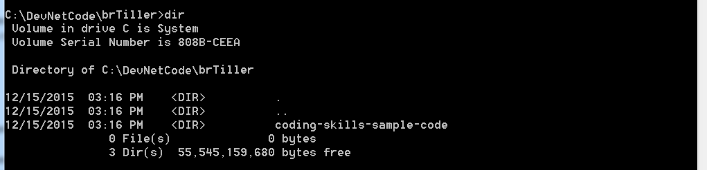
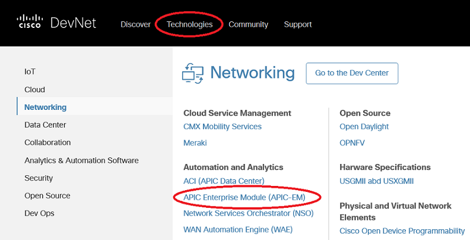

# Coding 207: Putting it all together

In this Learning Lab, you use all of the Coding 200 series skills together in one program. This program retrieves and saves a list of devices that have a user-specified device type.


## Objectives

Understand how to do the following:
* Prompt a user to enter data.
* Use the data entered by the user.
* Retrieve data using the DNA Center REST APIs.
* Save data to a file.
* Use the logging module.


## Prerequisites

**Background**
* Before starting this lab, complete the [Coding Fundamentals](https://developer.cisco.com/learning/modules/programming-fundamentals) and [REST API Fundamentals](https://developer.cisco.com/learning/modules/rest-api-fundamentals) Learning Lab modules.

**Access to DNA Center**
* To run these code samples, you need Access to DNA Center.
* **If you are not using your DNA Center**, use the [DevNet Sandbox](https://developer.cisco.com/site/devnet/sandbox/) DNA Center Lab: [https://sandboxdnac.cisco.com](https://sandboxdnac.cisco.com).

**Python**
* To run the code samples, you need to have Python 3 installed on your computer.
* **If you are working on a DevNet Learning Lab computer at a DevNet event**, Python 3.x is already installed.

For more information, click the "How to Set Up Your Computer" link at the top of this lab.

**Python Requests Library**
* These code samples use the Python Requests Library to simplify making REST API calls.
* **If you are working on a DevNet Learning Lab computer at a DevNet event**, the Requests Library is already installed.

For more information, click the "How to Set Up Your Computer" link at the top of this lab.

**Clone Git Repo**
* **If you are working on a DevNet Learning Lab computer at a DevNet event**
    * Open the Git Command window by clicking the *Git CMD* icon on the Task Bar or click the Start button. Then, in the Run bar, enter: `git cmd`.
* **If you are working from your computer**, on your computer open a command terminal.
* Go to the root directory by entering: `cd \`.
* Create a directory called 'C:\DevNetCode\yourname' by entering: `mkdir DevNetCode\<your-name>`.
    * For example: `mkdir DevNetCode\brTiller`
* Go to the new directory by entering: `cd \DevNetCode\<your-name>`.
    * For example: `cd \DevNetCode\brTiller`
* Clone the coding skills sample code from GitHub. Enter the following command:
```
git clone https://github.com/CiscoDevNet/coding-skills-sample-code
```
<br/><br/>
Inside the directory you created , you should see a new directory, 'coding-skills-sample-code'.<br/><br/>
<br/><br/>

## Step 1. Learn about this lab

In this Learning Lab, you are going to use all of the skills that you covered in these learning labs together in one application.

* [Coding 101: Rest API Basics](/lab/coding-101-rest-basics-ga/step/1)
* [Coding 102: Calling REST APIs from Python](/lab/coding-102-rest-python-ga/step/1)
* [Coding 202: Parsing JSON using Python](/lab/coding-202-parsing-json/step/1)
* [Coding 203: Getting input from a user in Python](/lab/coding-203-getting-input/step/1)
* [Coding 204: Reading data from a file using Python](/lab/coding-204-reading-a-file/step/1)
* [Coding 205: Writing data to a file using Python](/lab/coding-205-writing-file-ga/step/1)
* [Coding 206: Using the logging module in Python](/lab/coding-206-logging/step/1)

Here is the outline of what the application will do:

* Specify the file to use for logging and specify the logging level.
* Ask the user if they want to save a list of routers or switches.
* Ask the user for the filename that they want to use for the list of devices when saved.
* Use the DNA Center REST API to create an authorization ticket.
* Use the DNA Center REST API to get the total count of devices.
* Use the DNA Center REST API to get the list of network devices.
* Loop through the list of devices in the JSON response.
* If the device type is the type chosen by the user, write the device id and type to the file.

## Step 1: Find the DNA Center API Reference documentation

A good starting point to understand any API is to look at the documentation for the API. Now, find documentation for the DNA Center API.

1. In a browser, navigate to the [DevNet](https://developer.cisco.com/) home page.
1. Use the menu at the top to navigate to the DNA Center Platform page.
   * Click the **Technologies** link to see the submenu.
   * Click **Networking**.
   * From the list of technologies, click **DNA Center Platform**.


1. On the DNA Center Platform page, click the `Docs` link.
1. Click `API Reference`.
1. Select the latest API version.
1. Keep the DNA Center API Reference documentation open in a separate tab. This page provides a useful reference while you work on this lab.

Now, get started!

**Next step:**

Proceed to Step 2: Configure logging and ask the user for input.
