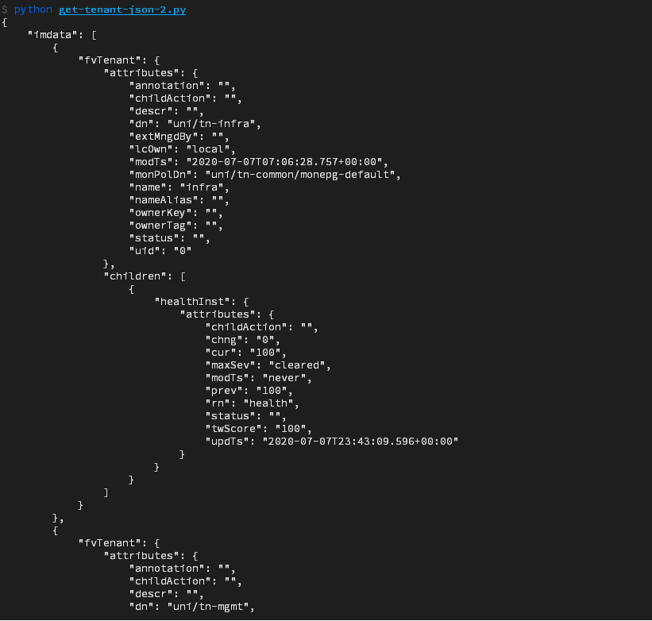

## Step 2: Use the JSON Python library

### Use Python's JSON object

The large JSON result you got in the previous step is a string. It has no special properties beyond that. To parse it, you would parse it as a string. However, Python comes with a standard `json` library for encoding/decoding and accessing JSON content. This library uses patterns that are familiar to Python developers. When you load a string using the `json` decoder, it converts JSON objects into Python [dictionaries](https://docs.python.org/3.4/reference/expressions.html#dictionary-displays) and JSON arrays into Python [lists](https://docs.python.org/3.4/reference/expressions.html#list-displays). This is useful because it then enables you to access and iterate through JSON as Python data.

Another useful tool of the JSON library is it's ability to "pretty print" the JSON output into a hierarchical structure. This makes it easier to see the overall structure of the data. Now, use that capability to print the data into a more human-readable output.

> **Note**: The `requests` library has the ability to return the data from the query in JSON without any additional lines of code, however, in this lab we will not be using this ability in order to understand how the `json` library works within Python. 

1. Normally, we'd need to odify the second line of `get-tenant-json.py` to import the JSON library, however, due to the construct of the ACI authentication, we've already imported it.  You can verify that this line is present in the file:

  ```
  import json
  ```

2. Comment out the `print(tenants.text)` line by putting a pound or hash sign at the front of the line:

  ```
  # print(tenants.text)
  ```
  You are commenting out this line because you are going to use the `json` library to pretty print your output.  

3. Update `get-tenant-json.py` by adding the following line below `#print(tenants.text)`:

  ```
  json_response = json.loads(tenants.text)
  ```

  The `json.loads()` method loads the `tenants.text` into a JSON object. If it is successful, you can use  square brackets to get a particular element from `json_response`.

4. Add the following line just below the previous line you added:

  ```
  print(json.dumps(json_response, sort_keys=True, indent=4))
  ```

  This line prints the elements `dumps()` method returns from the `json_response`. The arguments control how the output is displayed.

5. Save the `get-tenant-json.py` file. To download or review the current code, you can get it from GitHub [here](https://github.com/CiscoDevNet/coding-skills-sample-code/blob/master/coding202-parsing-json/get-tenant-json-2.py).

6. To run your newly created file, enter:

  ```
  python get-tenant-json.py
  ```

7. The Python script gets and displays the following JSON data.



--------------------------------------------------------------------------------

The content and structure of this data is easier for you to read and understand.

### Understanding the returned JSON data

Because you are getting JSON data, the content you get back has a particular order or schema. Elements of the returned 'fv-Tenant' ACI Managed Object (MO) class parsed in JSON data have sub-objects and even sub-dictionaries and sub-lists. For this exercise, you are interested in the **name**, **dn**, and **health** of each of the tenants configured within the fabric. This approach returns the desired information, as well as additional bits returned as part of the query to the `fv-Tenant` class.

```
{fvTenant}
  {attributes}
  annotation
  childAction
  descr
  dn
  extMngdBy
  lcOwn
  modTs
  monPolDn
  name
  nameAlias
  ownerKey
  ownerTag
  status
  uid
  {children}
    {healthInst}
      {attributes}
      ...
      ...
...
```

In the example shown, `fvTenant` is dictionary of multiple tenant objects - each with their `name`, `dn`, and other attributes.

Now that you have seen this structure, go to the next step and learn how to get only the data you care about.

**Next step:**

Proceed to Step 3: Iterate through a JSON dictionary in Python.
