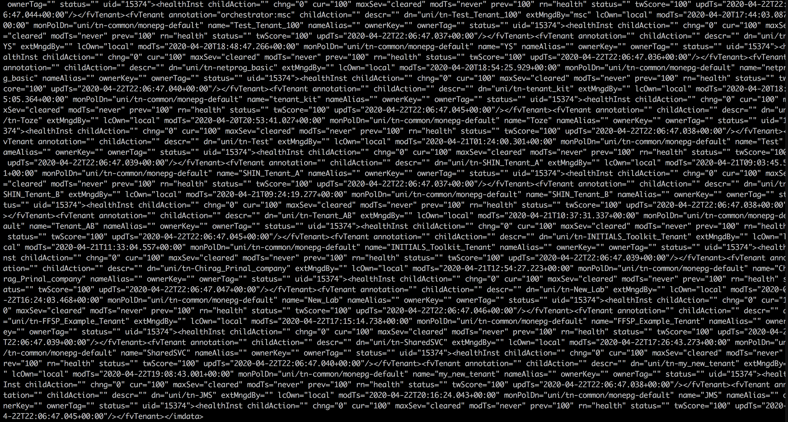

# Parsing XML using Python  

In this Learning Lab, you learn the basics of parsing XML content using Python. The example runs a query on the [ACI Always-On Sandbox](https://devnetsandbox.cisco.com/RM/Diagram/Index/5a229a7c-95d5-4cfd-a651-5ee9bc1b30e2?diagramType=Topology "ACI Always-On Sandbox") in order to request data for available configuration on the fabric.  We will then parse this returned data and print it to the screen for human readability.  To learn more about ACI and its API, you can review the DevNet [learning track for ACI programmability](https://developer.cisco.com/learning/tracks/aci-programmability), which covers a variety of different ways to interact with ACI programmatically.  ACI is used as a basis for these labs as the managed object model within ACI allows us to query the same object or class within the fabric and return both XML and JSON data structures, simply based on changing the file-type within the REST URL.

## Objectives

* Understand the basics of reading and parsing XML content from HTTP using Python.
* Evaluate data returned from the ACI Always-On Sandbox
* Use Python to extract only the XML data you want, using Minidom.

## Prerequisites

* Complete the [Coding Fundamentals](https://developer.cisco.com/learning/modules/programming-fundamentals) and [REST API Fundamentals](https://developer.cisco.com/learning/modules/rest-api-fundamentals) Learning Lab modules if you are unfamiliar with Python and retrieving results from a RESTful service and the [Parsing XML using Python Lab](lab/coding-201-parsing-xml/step/1 "Parsing XML using Python Lab") for a similar approach to retrieving data using XML.

* You should also have a basic familiarity with JSON. Otherwise, consider visiting the [W3Schools JSON Tutorial](https://www.w3schools.com/js/js_json_intro.asp "W3Schools JSON Tutorial") to get a firm base to build upon.

For this lab, use Python 3.4+. If you are on a DevNet Zone station, the correct version of Python should already be installed. If you are following this lab online, check the version by entering the following command in a terminal or command prompt window:
```
python --version
```

## Example: Make an HTTP REST call with Python

> **Note**: This lab leverages the DevNet Always-On ACI Sandbox, however you can substitute this with a local APIC if you have one available.  The sets of sample code contained within this lab will not perform any write or configuration actions against the fabric; they will only request currently configured data.

To get started, this walk-through shows creating a simple Python script that sends an HTTP request to the ACI sandbox.

Example `get-tenants-xml.py` file:
``` python
import requests
import xml.dom.minidom
# We need to import the JSON library just to handle our request to the APIC for login
import json


# We need to log in to the APIC and gather a token, before we can access any data
# Let's construct a request with a body

# We'll need to disable certificate warnings
requests.packages.urllib3.disable_warnings()

# We need to have a body of data consisting of a username and password to gather a cookie from APIC
encoded_body = json.dumps({
	        "aaaUser": {
		        "attributes": {
			        "name": "admin",
			        "pwd": "ciscopsdt"
                 }
            }
})

# Now lets make the request and store the data
resp = requests.post("https://sandboxapicdc.cisco.com/api/aaaLogin.json", data=encoded_body, verify=False)

# This stores the received APIC-cookie from the login as a value to be used in subsequent REST calls
header = {"Cookie": "APIC-cookie=" +  resp.cookies["APIC-cookie"]}

# Now we make a call towards the tenant class on the ACI fabric with the proper header value set.
# We leverage the .xml ending to receive the data back as XML.  We're adding health and faults to the printout to ensure that we get levels of data back from the APIC
tenants = requests.get("https://sandboxapicdc.cisco.com/api/node/class/fvTenant.xml?rsp-subtree-include=health,faults", headers=header, verify=False)

# Requests stores the text of the response in the .text attribute.  Lets print it to see raw XML
print(tenants.text)
```

There's a lot to unpack here, but most of it is related to the idiosyncrasies of ACI and the required authentication.  What is important to focus on is that we have:
-  imported the `requests` library to easily interact with REST APIs
-  constructed a call to authenticate against the APIC and store the authentication token as a cookie to be used later
-  created a request to ask for all configured tenants in the fabric using the stored authentication cookie
-  accessed the response from the query and printed the raw XML output to the console/terminal  

To download or review the current code, you can get it from GitHub <a href="https://github.com/CiscoDevNet/coding-skills-sample-code/blob/master/coding201-parsing-xml/get-tenants-xml-1.py" target="_blank">here</a>.

If you are using Windows, enter the following command into the command prompt window to move to your computer:
```
cd %USERPROFILE%\Desktop
```
If you are using OS X, enter the following command into the terminal to move to your computer:
```
cd ~/Desktop
```
In the command prompt window, enter the following command:
```
python get-tenants-xml.py
```

> **Note**: Ensure that the Python version in use is greater than 3.4.  If you get errors, verify the version of Python and double-check the code.

When you run the Python script, the terminal displays a screen full of XML data.



----------

By using the `.xml` ending to our query, ACI returned the tenant data back to us in XML.  For the purposes of this lab, this is exactly what we want.  In the next step, you will clean up this data and display something more specific.

**Next step:**

Proceed to Step 2: Understand the returned XML data.
